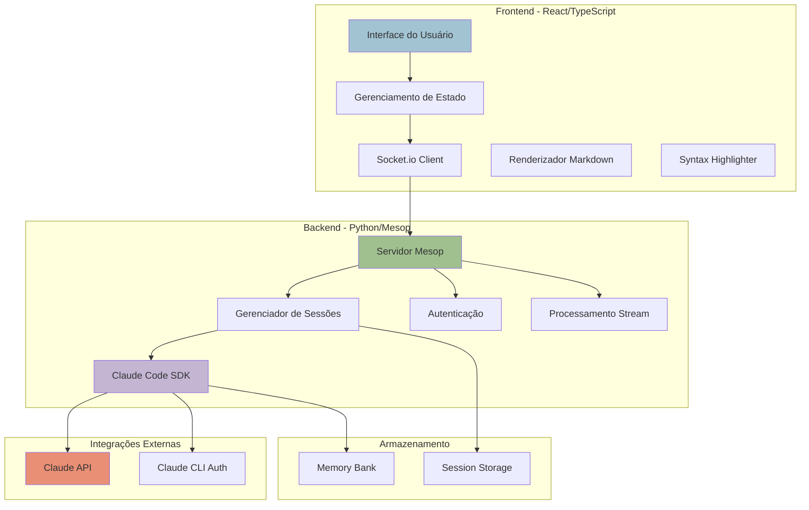
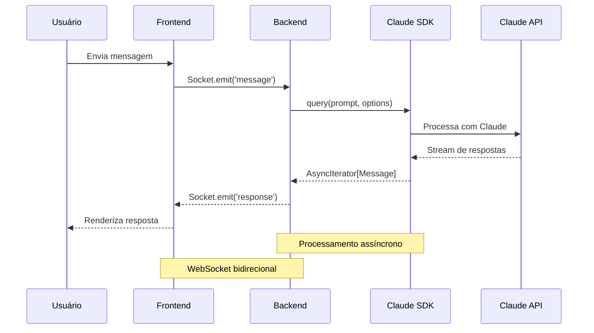
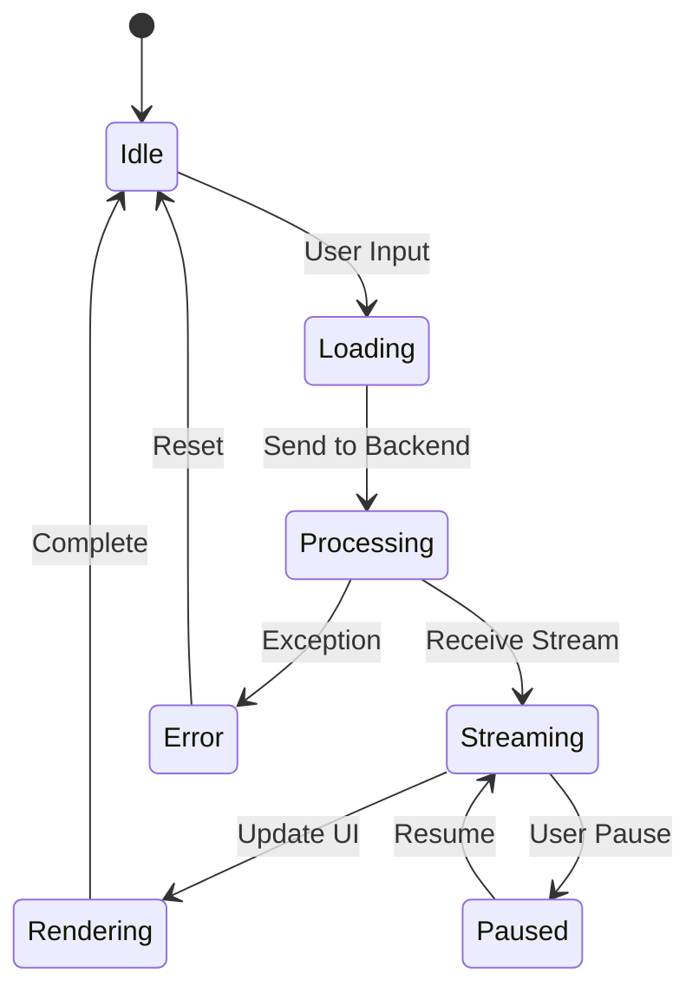

# 🏗️ Arquitetura do Sistema - Chat App SDK

## 📊 Visão Geral

Sistema de chat integrado com Claude Code SDK, implementando arquitetura cliente-servidor com processamento assíncrono e gerenciamento de estado avançado.

## 🎯 Diagrama de Arquitetura



## 🔄 Fluxo de Dados



## 🧩 Componentes Principais

### Frontend (React/TypeScript)

| Componente | Responsabilidade | Tecnologias |
|------------|-----------------|-------------|
| **App.tsx** | Container principal, roteamento | React 19, TypeScript |
| **MessageList** | Renderização de mensagens | ReactMarkdown, remarkGfm |
| **InputArea** | Entrada de texto e arquivos | React Hooks |
| **CodeBlock** | Syntax highlighting | Prism, react-syntax-highlighter |
| **SocketManager** | Comunicação WebSocket | socket.io-client |

### Backend (Python/Mesop)

| Componente | Responsabilidade | Tecnologias |
|------------|-----------------|-------------|
| **app.py** | Servidor principal e rotas | Mesop, asyncio |
| **ChatSession** | Gerenciamento de sessões | dataclasses, uuid |
| **ClaudeSDK** | Integração com Claude | claude-code-sdk |
| **MessageHandler** | Processamento de mensagens | async/await |
| **StreamProcessor** | Streaming de respostas | AsyncIterator |

## 📦 Estrutura de Dados

### Message
```python
@dataclass
class Message:
    id: str
    role: "user" | "assistant"
    content: str
    timestamp: datetime
    metadata: Dict[str, Any]
    is_streaming: bool
    in_progress: bool
```

### ChatSession
```python
@dataclass
class ChatSession:
    id: str
    messages: List[Message]
    created_at: datetime
    last_activity: datetime
    title: str
    context: str
    claude_session_id: Optional[str]
```

### ProcessingStep
```python
@dataclass
class ProcessingStep:
    type: str
    message: str
    data: Dict[str, Any]
    timestamp: datetime
```

## 🔐 Segurança

### Autenticação
- **Claude CLI Auth**: Usa `claude auth login` global
- **API Key**: Variável de ambiente `ANTHROPIC_API_KEY`
- **Session Management**: UUID único por sessão
- **Token Validation**: Verificação automática via SDK

### Proteções
- Sanitização de entrada HTML
- Rate limiting via Claude API
- Session timeout configurável
- CORS habilitado para domínios específicos

## ⚡ Performance

### Otimizações Implementadas
- **Streaming**: Respostas em tempo real via AsyncIterator
- **Lazy Loading**: Componentes React carregados sob demanda
- **Memoização**: React.memo para componentes pesados
- **Debouncing**: Input com delay de 300ms
- **Virtual Scrolling**: Para listas grandes de mensagens

### Métricas Alvo
- Latência primeira resposta: < 500ms
- Throughput: 100 req/s
- Memory footprint: < 512MB
- CPU usage: < 30% idle

## 🔄 Estado e Sincronização



## 🎨 Design System

### Paleta de Cores (Anthropic-inspired)
- **Primary**: #A2C3D2 (Accent Blue)
- **Success**: #A0C090 (Green)
- **Warning**: #C4B5D3 (Purple)
- **Error**: #E98F75 (Red)
- **Background**: #F2EFEB
- **Surface**: #FFFFFF

### Tipografia
- **Headers**: System UI, -apple-system
- **Body**: Inter, Helvetica Neue
- **Code**: Consolas, Monaco, monospace

## 📊 Monitoramento

### Logs
- **Backend**: Python logging + Mesop debug
- **Frontend**: Console + React DevTools
- **SDK**: Claude Code verbose mode

### Métricas
- Tempo de resposta
- Taxa de erro
- Uso de tokens
- Sessões ativas
- Memory usage

## 🚀 Deployment

### Requisitos
- Python 3.12+
- Node.js 18+
- Claude CLI configurado
- 512MB RAM mínimo
- 1 CPU core

### Variáveis de Ambiente
```bash
ANTHROPIC_API_KEY=sk-xxx
MESOP_PORT=8080
REACT_APP_API_URL=http://localhost:8080
NODE_ENV=production
```

## 🔧 Pontos de Extensão

1. **Plugins de Processamento**: Adicionar novos handlers de mensagem
2. **Temas Customizados**: Sistema de temas via CSS-in-JS
3. **Providers de IA**: Suporte para outros modelos além do Claude
4. **Storage Backends**: Redis, PostgreSQL, MongoDB
5. **Webhooks**: Integração com sistemas externos

## 📈 Roadmap de Melhorias

### Curto Prazo
- [ ] Cache de respostas frequentes
- [ ] Compressão de WebSocket
- [ ] PWA support
- [ ] Dark mode

### Médio Prazo
- [ ] Multi-tenant support
- [ ] Analytics dashboard
- [ ] Voice input/output
- [ ] File attachments

### Longo Prazo
- [ ] Kubernetes deployment
- [ ] GraphQL API
- [ ] Plugin marketplace
- [ ] Mobile apps